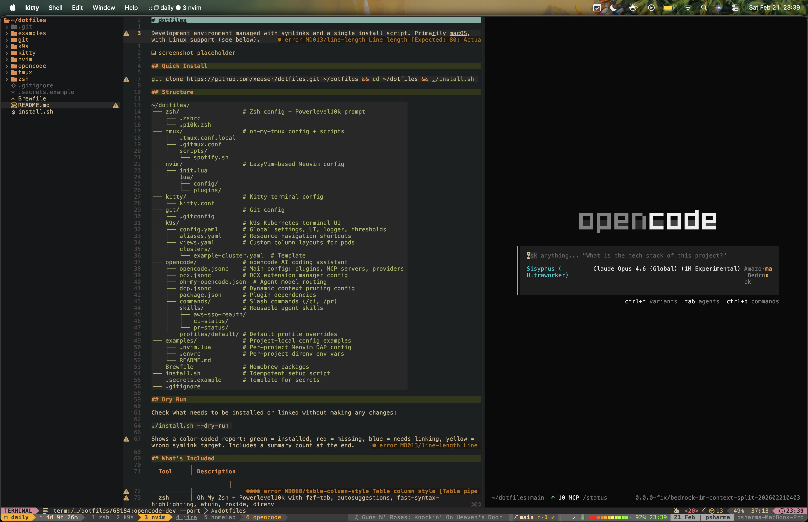

# dotfiles

Development environment managed with symlinks and a single install script. Primarily macOS, with Linux support (see below).



## Quick Install

```bash
git clone https://github.com/xeaser/dotfiles.git ~/dotfiles && cd ~/dotfiles && ./install.sh
```

## Structure

```
~/dotfiles/
├── zsh/                  # Zsh config + Powerlevel10k prompt
│   ├── .zshrc
│   └── .p10k.zsh
├── tmux/                 # oh-my-tmux config + scripts
│   ├── .tmux.conf.local
│   ├── .gitmux.conf
│   └── scripts/
│       └── spotify.sh
├── nvim/                 # LazyVim-based Neovim config
│   ├── init.lua
│   └── lua/
│       ├── config/
│       └── plugins/
├── kitty/                # Kitty terminal config
│   └── kitty.conf
├── git/                  # Git config
│   └── .gitconfig
├── k9s/                  # k9s Kubernetes terminal UI
│   ├── config.yaml       # Global settings, UI, logger, thresholds
│   ├── aliases.yaml      # Resource navigation shortcuts
│   ├── views.yaml        # Custom column layouts for pods
│   └── clusters/
│       └── example-cluster.yaml  # Template
├── opencode/             # opencode AI coding assistant
│   ├── opencode.jsonc    # Main config: plugins, MCP servers, providers
│   ├── ocx.jsonc         # OCX extension manager config
│   ├── oh-my-opencode.json  # Agent model routing
│   ├── dcp.jsonc         # Dynamic context pruning config
│   ├── package.json      # Plugin dependencies
│   ├── commands/         # Slash commands (/ci, /pr)
│   ├── skills/           # Reusable agent skills
│   │   ├── aws-sso-reauth/
│   │   ├── ci-status/
│   │   └── pr-status/
│   └── profiles/default/ # Default profile overrides
├── examples/             # Project-local config examples
│   ├── .nvim.lua         # Per-project Neovim DAP config
│   ├── .envrc            # Per-project direnv env vars
│   └── README.md
├── Brewfile              # Homebrew packages
├── install.sh            # Idempotent setup script
├── .secrets.example      # Template for secrets
└── .gitignore
```

## Dry Run

Check what needs to be installed or linked without making any changes:

```bash
./install.sh --dry-run
```

Shows a color-coded report: green = installed, red = missing, blue = needs linking, yellow = wrong symlink target. Includes a summary count at the end.

## What's Included

| Tool | Description |
|------|-------------|
| **zsh** | Oh My Zsh + Powerlevel10k with fzf-tab, autosuggestions, fast-syntax-highlighting, atuin, zoxide, direnv |
| **tmux** | oh-my-tmux with gruvbox theme, gitmux status, spotify, session management via sesh |
| **nvim** | LazyVim with gruvbox-material, avante (AI), neotest, DAP, opencode.nvim, project manager |
| **kitty** | Gruvbox dark theme, Nerd Fonts, powerline tabs |
| **k9s** | Kubernetes terminal UI with custom aliases (dp, sec, jo), pod column layouts with image versions and resource usage |
| **opencode** | AI coding assistant with oh-my-opencode model routing, MCP servers (postgres, GitHub, Atlassian, JetBrains, Obsidian), custom skills (AWS SSO, CI status, PR status), slash commands |
| **brew** | All packages captured in Brewfile |

## Secrets Management

Secrets are never committed. The install script creates `~/.secrets` from `.secrets.example` on first run.

```bash
# After install, edit:
vim ~/.secrets
chmod 600 ~/.secrets
```

Sourced automatically by `.zshrc`.

## Key Shortcuts

### Zsh

| Shortcut | Action |
|----------|--------|
| `vim` / `vi` | Opens Neovim |
| `viz` | Edit .zshrc |
| `soz` | Source .zshrc |
| `k` | kubectl |
| `tdaily` | Attach to tmux "daily" session |

### Tmux (prefix: Ctrl+a)

| Shortcut | Action |
|----------|--------|
| `prefix + T` | sesh session picker (fzf) |
| `prefix + Z` | tmux-fzf launcher |
| `prefix + Space` | tmux-thumbs (copy hints) |
| `F12` | Suspend tmux (nested sessions) |
| `Ctrl+h/j/k/l` | Navigate panes (vim-aware) |

### Neovim (leader: Space)

| Shortcut | Action |
|----------|--------|
| `leader + aa` | Avante AI assistant |
| `leader + gg` | LazyGit |
| `leader + tt` | Run nearest test |
| `leader + td` | Debug nearest test |
| `leader + pp` | Browse projects |
| `leader + oo` | Toggle opencode |
| `Ctrl+h/j/k/l` | Navigate splits (tmux-aware) |

## Linux Support

The setup is primarily macOS but works on Linux with `--skip-brew`:

```bash
./install.sh --skip-brew
```

This skips Homebrew and installs all symlinks, clones oh-my-zsh, plugins, oh-my-tmux, and powerlevel10k.

**Install packages manually on Linux** using your distro's package manager before running the script:

```bash
# Debian/Ubuntu
sudo apt install zsh tmux neovim fzf kitty git curl

# Arch
sudo pacman -S zsh tmux neovim fzf kitty git curl
```

Then install tools not in distro repos (zoxide, atuin, sesh, gitmux, lazygit, direnv) via their official install instructions or Homebrew for Linux.

**macOS-only features** (skipped automatically on Linux):
- `toggleNotch`, `volUp` aliases (osascript)
- Spotify status in tmux (requires osascript)
- `macos_option_as_alt` in kitty
- Homebrew casks (GUI apps)
